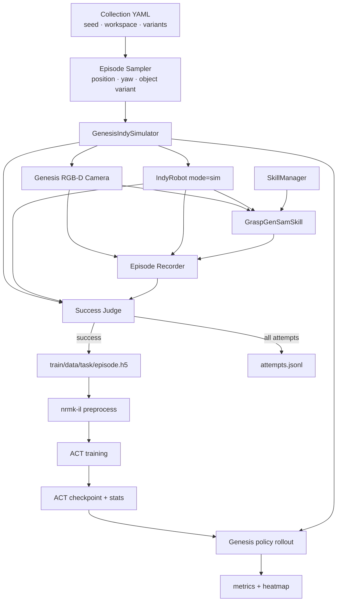
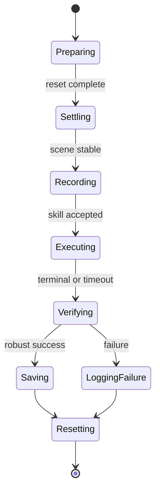

# Indy Picking Simulation Imitation Learning Plan

> 문서 상태: Active / 0단계 고정 박스 smoke 완료  
> 마지막 갱신: 2026-09-07  
> 1차 목표: Genesis에서 GraspGen-SAM 성공 시연을 수집하고 ACT를 학습한 뒤, Genesis에서 학습 정책을 평가한다.  
> 후속 목표: 동일한 관측·행동 계약을 유지하면서 실제 Indy 로봇으로 배포한다.

빠른 이동:

- [목표 아키텍처](#5-목표-아키텍처)
- [Observation 및 action 데이터 계약](#8-observation-및-action-데이터-계약)
- [Scene randomization 전략](#10-scene-randomization-전략)
- [구현 단계와 완료 조건](#16-구현-단계와-완료-조건)
- [결정 기록](#23-결정-기록)
- [진행 현황](#24-진행-현황)

## 1. 문서의 목적

이 문서는 다음 작업을 여러 세션과 여러 저장소에 걸쳐 일관되게 진행하기 위한 기준 문서다.

- Genesis에서 Indy와 red box picking 장면을 생성한다.
- `graspgen_sam`을 전문가 정책으로 사용한다.
- 성공적으로 물체를 집고 들어 올린 시연만 imitation-learning H5 데이터로 저장한다.
- 실패 시도도 위치, 물체 특성, 실패 단계와 함께 별도 manifest에 기록한다.
- `nrmk-il`의 기존 전처리와 ACT 학습 코드를 최대한 재사용한다.
- 학습된 ACT 정책을 실제 로봇에 배포하기 전에 같은 Genesis 장면에서 평가한다.
- 매 episode 종료 시 성공/실패와 무관하게 장면을 초기화한다.
- 위치뿐 아니라 크기, 종횡비, 색상, 조명 등의 변화에 대한 일반화 성능을 단계적으로 확보한다.

이 문서는 실행 명령 모음만이 아니라 다음 항목의 단일 기준점(single source of truth) 역할을 한다.

- 저장소별 책임과 변경 범위
- observation/action 데이터 계약
- episode 상태 전이와 성공 판정
- 데이터 randomization 및 train/validation/test 분리 원칙
- 구현 순서와 단계별 완료 조건
- 알려진 위험과 미결정 사항

## 2. 범위

### 2.1 현재 범위

- 단일 Indy 로봇
- 단일 gripper
- Genesis simulation
- 테이블 위 단일 box pick
- `graspgen_sam` 기반 전문가 시연
- pick만 수행하고 place는 수행하지 않음
- 성공 시연 기반 behavioral cloning
- ACT task-space policy
- Genesis 안에서 learned-policy rollout 및 평가

### 2.2 현재 범위가 아닌 항목

- 실제 Indy 로봇 배포
- 여러 물체 중 특정 물체를 골라 집는 복잡한 clutter scene
- place 또는 pick-and-place 전체 task
- 실패 시연을 직접 이용하는 offline RL
- DAgger를 이용한 전문가 재질의
- 강화학습 기반 fine-tuning
- photorealistic sim-to-real 완성

이 항목들은 simulation pick pipeline이 안정화된 뒤 별도 milestone로 확장한다.

## 3. 관련 저장소와 책임

로컬 저장소 위치는 다음과 같다.

```text
/home/nrmk/Dohyun/git/
├── nrmk-il
├── nrmk_nn_control
└── robot_interface
```

| 저장소 | 책임 | 계획된 주요 변경 |
|---|---|---|
| `nrmk_nn_control` | Genesis 장면, GraspGen-SAM skill, episode orchestration | collector, randomizer, 성공 판정, scene-state 조회, sim rollout runner |
| `nrmk-il` | H5 전처리, dataset, ACT 학습·추론 | simulation용 config, inference wrapper, 문서 |
| `robot_interface` | real/sim 공통 Indy 상태·명령 계약 | 정확한 expert task-space label을 위한 simulation FK |

책임 경계는 다음 원칙을 따른다.

- 물체 배치, scene reset, box pose 조회는 `nrmk_nn_control`의 Genesis 계층이 소유한다.
- robot joint/state/IK/FK 및 real/sim 단위 경계는 `robot_interface`가 소유한다.
- dataset 변환, 모델 학습, checkpoint loading과 neural-network 전처리는 `nrmk-il`이 소유한다.
- scene reset 기능을 `robot_interface`에 넣지 않는다.
- Genesis 또는 SAM 의존 코드를 `nrmk-il` 학습 core에 직접 섞지 않는다.

## 4. 현재 확인된 재사용 지점

### 4.1 Genesis episode reset

`nrmk_nn_control/skill_server/indy/sim/genesis_simulator.py`의 `reset_episode()`는 이미 다음 기능을 제공한다.

- box position 변경
- box quaternion 변경
- Indy joint position 초기화
- gripper open/close 초기화
- 물체와 로봇 velocity 제거
- 초기화 직후 observation 발행

제약 사항:

- Genesis main thread에서 호출해야 한다.
- 현재는 box pose만 episode별로 변경할 수 있다.
- box size와 color는 simulator 생성 시 결정된다.
- table과 tray는 초기화 대상이 아니다.

따라서 collector는 Genesis main loop와 협력하도록 구현하고, 외부 프로세스가 Genesis entity를 직접 조작하지 않도록 한다.

### 4.2 GraspGen-SAM skill

현재 webapp preset은 다음 의미를 갖는다.

```yaml
graspgen_sam:
  prompt: "red box"
  mask_selection: "highest_score"
  enable_pick: true
  enable_place: false
```

대량 데이터 수집에서 webapp은 필수 제어 경로로 사용하지 않는다. Collector가 기존 `SkillManager`와 `GraspGenSamSkill`을 직접 호출하고 webapp은 다음 용도로 유지한다.

- 수동 smoke test
- 카메라/point cloud 확인
- skill 상태 모니터링
- 문제 episode 재현

### 4.3 Real/sim Indy 상태 계약

`robot_interface.IndyRobot.get_state()`는 simulation 상태를 real backend와 동일한 외부 단위로 변환한다.

```text
q       : degree
qdot    : degree/s
p       : [x_mm, y_mm, z_mm, roll_deg, pitch_deg, yaw_deg]
pdot    : [mm/s, mm/s, mm/s, deg/s, deg/s, deg/s]
```

수집기는 이 반환값을 그대로 raw H5에 기록한다. 수집 단계에서 rad/m로 다시 바꾸지 않는다. `nrmk-il/train/preprocess.py`가 학습용 단위 변환을 담당한다.

현재 Genesis가 발행하는 task-space `pdot`은 실제 미분값이 아니라 0으로 채워져 있다. 초기 모델 입력에서 `pdot`을 제외하거나, 포함해야 한다면 collector에서 timestamp 기반 finite difference를 계산하고 low-pass filtering 및 reset 경계 처리를 추가한다. 이 결정은 M0에서 확정한다.

### 4.4 기존 ACT 학습 코드

`nrmk-il`은 다음 기능을 이미 제공한다.

- raw H5 전처리
- 단일 로봇 + gripper task-space config
- RGB 및 선택적 depth 입력
- ACT action chunk 학습
- image crop/resize
- `ColorJitter` 기반 image augmentation
- success label을 포함할 수 있는 dataset

초기 구현에서는 학습 core를 재작성하지 않고 simulation 전용 YAML과 얇은 inference wrapper를 추가한다.

## 5. 목표 아키텍처



## 6. 전체 실행 흐름

### 6.1 전문가 데이터 수집

```text
collection config 로드
    ↓
seed와 split에 맞는 episode specification 생성
    ↓
object variant 선택 또는 scene 생성
    ↓
box 위치·yaw와 robot/gripper 초기화
    ↓
물리 안정화
    ↓
recorder 시작
    ↓
graspgen_sam 실행
    ↓
20 Hz로 observation + 실제 expert command 기록
    ↓
terminal 상태와 물체 lift 상태 확인
    ├─ 성공: H5 atomic 저장 + manifest 기록
    └─ 실패: H5 폐기 + manifest 기록
    ↓
finally에서 scene reset
```

### 6.2 학습

```text
성공 H5 검증
    ↓
preprocess.py 실행
    ↓
processed_data 통계와 shape 검사
    ↓
작은 dataset으로 ACT smoke training
    ↓
GPU 메모리에 맞춰 batch size 확정
    ↓
전체 train split 학습
    ↓
validation loss와 rollout 후보 checkpoint 선정
```

### 6.3 Simulation deploy

```text
GraspGen/SAM expert service 비활성화
    ↓
checkpoint + normalization stats 로드
    ↓
held-out episode specification 선택
    ↓
scene reset + 안정화
    ↓
Genesis observation을 training과 동일하게 전처리
    ↓
ACT action chunk 추론 및 task-space command 실행
    ↓
simulation ground truth로 성공 판정
    ↓
metrics 기록 후 무조건 reset
```

## 7. Episode 상태 모델

권장 상태 전이는 다음과 같다.



모든 예외 경로는 `Resetting`으로 수렴해야 한다.

### 7.1 Episode 시작 조건

- 이전 skill job이 terminal 상태다.
- robot command/action queue가 비어 있다.
- gripper가 open 상태다.
- robot joint가 초기 자세 허용 오차 안에 있다.
- box가 의도한 pose에 있다.
- box linear/angular velocity가 안정화 임계값 이하다.
- 최신 camera frame이 reset 이후 생성된 frame이다.

### 7.2 Episode 종료 조건

- `succeeded`
- `failed`
- `cancelled`
- `timed_out`
- collector 내부 예외
- simulator 종료 요청

어떤 종료 사유든 manifest를 기록하고 scene reset을 수행한다.

## 8. Observation 및 action 데이터 계약

### 8.1 Raw H5 기본 필드

현재 `nrmk-il` 전처리와 호환되도록 다음 raw field를 사용한다.

| H5 key | shape 예시 | dtype | 단위/의미 | 출처 |
|---|---:|---|---|---|
| `q_0` | `[T, 6]` | `float32` | joint position, degree | `IndyRobot.get_state()` |
| `qdot_0` | `[T, 6]` | `float32` | joint velocity, degree/s | `IndyRobot.get_state()` |
| `p_0` | `[T, 6]` | `float32` | XYZ mm + Euler degree | `IndyRobot.get_state()` |
| `pdot_0` | `[T, 6]` | `float32` | linear mm/s + angular degree/s | `IndyRobot.get_state()` |
| `images.rgb.sim` | `[T, H, W, 3]` | `uint8` | Genesis RGB | Genesis camera |
| `images.depth.sim` | `[T, H, W]` | 구현 결정 | 선택적 depth | Genesis camera |
| `gripper_position_0` | `[T, 1]` | `float32` | normalized 0~1 | Genesis gripper state |
| `grasp_state_0` | `[T, 1]` | `bool` 또는 `float32` | 양 finger contact 기반 grasp | Genesis |
| `tele_abs_control_0` | `[T, 6]` | `float32` | expert XYZ mm + Euler degree | expert command tap + FK |
| `gripper_command_0` | `[T, 1]` | `float32` | 0 close, 1 open | expert command |

정확한 key 이름과 shape는 첫 smoke episode를 `preprocess.py`에 통과시키면서 최종 고정한다.

### 8.2 Sampling 시간

- Genesis physics step: 현재 `0.005 s`
- GraspGen trajectory sample: 현재 `0.02 s`
- IL raw recording target: `0.05 s`, 즉 20 Hz 권장

수집기는 physics step마다 H5 row를 추가하지 않는다. observation과 command를 timestamp와 함께 수집하고 20 Hz 기준으로 정렬하거나 resampling한다.

필수 시간 정보:

- monotonic timestamp
- simulation time 또는 physics step index
- camera frame timestamp/sequence
- robot observation timestamp/sequence
- expert command timestamp/sequence

### 8.3 Task-space action label

현재 GraspGen 실행기는 joint command를 보간해 `tele_move_joint_deg()`로 전송한다. ACT는 task-space target을 학습하므로 다음 변환을 권장한다.

```text
실제로 전송한 expert joint target
    → Indy simulation forward kinematics
    → task-space target [mm, degree]
    → tele_abs_control_0
```

측정된 다음 시점의 end-effector pose를 action label로 대체하지 않는다. 이 방식은 simulation tracking delay와 dynamics를 action에 섞어 실제 로봇 이전성을 낮춘다.

현재 `robot_interface`의 Indy simulation FK는 완성되어 있지 않으므로 정확성 우선 구현에서는 이를 보완한다.

대안:

- GraspGen 내부 Cartesian target을 노출해 저장할 수 있다.
- 하지만 joint interpolation으로 실제 전송된 target과 차이가 생길 수 있으므로 빠른 MVP에만 사용한다.

### 8.4 H5 attribute

에피소드 단위 정보는 일반 dataset key가 아니라 H5 attribute로 저장한다.

```text
schema_version
task_name
episode_id
attempt_id
split
seed
object_variant_id
initial_box_position_m
initial_box_quat_wxyz
box_size_m
box_color_rgb
control_dt_s
physics_dt_s
expert_skill
expert_prompt
terminal_status
retry_count
scene_config_hash
software_revision
```

## 9. 성공 및 실패 판정

### 9.1 학습 데이터로 인정하는 성공

다음 조건을 모두 만족해야 한다.

```text
skill terminal status == succeeded
AND grasp_state == true
AND box center z - initial box center z >= minimum_lift_m
AND 위 조건이 hold_time_s 동안 유지됨
```

초기 권장값:

```yaml
success:
  minimum_lift_m: 0.05
  hold_time_s: 0.50
```

수치는 feasibility 실험 결과에 따라 조정한다.

### 9.2 실패 분류

| failure stage | 예시 |
|---|---|
| `scene_reset` | box/robot pose 초기화 실패 |
| `scene_settle` | 물체가 안정화되지 않음 |
| `camera` | reset 이후 유효 frame 없음 |
| `sam_detection` | prompt 대상 mask 없음 |
| `point_extraction` | object point 부족 |
| `grasp_inference` | grasp 후보 없음 또는 서비스 오류 |
| `ik` | 접근/lift trajectory IK 실패 |
| `motion` | timeout 또는 joint tracking 실패 |
| `gripper` | grasp contact 확인 실패 |
| `lift` | 들어 올리지 못함 또는 중간에 놓침 |
| `collector` | recorder/H5/internal error |

실패 episode는 기본 behavioral-cloning H5에 포함하지 않는다. 대신 모든 실패를 `attempts.jsonl`에 보존해 workspace heatmap과 expert coverage 분석에 사용한다.

### 9.3 Atomic 저장

성공 판정 전에는 최종 H5 이름으로 저장하지 않는다.

```text
.tmp/attempt-<id>.h5
    ↓ success + integrity check
train/data/<task>/<episode_id>.h5
```

프로세스 중단이나 저장 실패로 불완전한 H5가 학습 폴더에 들어가지 않도록 한다.

## 10. Scene randomization 전략

### 10.1 원칙

물체 특성은 한 번에 전부 무작위화하지 않고 curriculum으로 추가한다.

```text
고정 장면
    → 위치/yaw
    → 크기/종횡비
    → 색상/조명/재질
    → 여러 변형의 조합
    → held-out 조합 평가
```

이 순서를 사용하면 실패가 발생했을 때 workspace, geometry, SAM, motion 중 원인을 분리하기 쉽다.

### 10.2 위치 feasibility survey

현재 GraspGen-SAM detection workspace를 첫 번째 후보 범위로 사용한다.

```text
x: 0.35 ~ 0.55 m
y: -0.15 ~ 0.15 m
z: 물체 높이와 table top으로 계산
```

실제 sampling 영역은 다음 교집합이다.

```text
detection workspace
∩ table collision-safe area
∩ Indy IK reachable area
∩ camera valid-depth area
```

첫 survey는 순수 random보다 격자 또는 Latin-hypercube sampling을 권장한다. 위치별 여러 seed를 실행해 성공률 heatmap을 만든다.

### 10.3 위치와 yaw

- 학습 데이터 수집 전 `reset_episode()`에서 적용한다.
- 고정 seed를 사용해 episode spec을 재생성할 수 있게 한다.
- 위치 cell별 성공 데이터 수를 관리해 쉬운 중앙 영역으로 데이터가 몰리지 않게 한다.
- yaw 범위는 작은 값부터 시작해 점진적으로 확대한다.

### 10.4 크기와 종횡비

크기는 grasp pose, finger 접촉 위치와 lift trajectory에 영향을 주므로 이미지 augmentation으로 대체할 수 없다. 각 geometry에 대해 GraspGen-SAM 전문가 시연을 새로 생성해야 한다.

초기 예시:

```yaml
object_variants:
  - id: red_small
    size_m: [0.050, 0.050, 0.070]
    color: [0.80, 0.05, 0.05]

  - id: red_medium
    size_m: [0.060, 0.060, 0.080]
    color: [1.00, 0.00, 0.00]

  - id: red_wide
    size_m: [0.080, 0.050, 0.070]
    color: [0.90, 0.10, 0.10]
```

물체 중심 높이는 항상 다음처럼 계산한다.

```text
box_center_z = table_top_z + box_height / 2 + clearance
```

현재 Genesis box의 `size_m`과 `color`는 simulator 생성 시 고정된다. 1차 구현은 variant 하나로 scene을 생성한 뒤 여러 위치/yaw episode를 수집하고 다음 variant로 scene을 다시 생성하는 방식으로 진행한다. Episode별 entity 교체는 성능이 실제 병목으로 확인될 때 최적화한다.

### 10.5 색상과 시각 특성

목표가 red box picking이라면 먼저 의미를 바꾸지 않는 변형을 사용한다.

- red 계열 hue 변화
- saturation/brightness 변화
- 표면 반사도 변화
- 조명 밝기와 방향
- table/background 색상
- camera noise와 약한 blur

현재 expert prompt가 `red box`이므로 임의의 파랑/초록 box를 생성하면 SAM 실패가 정상이다. 여러 색상 box를 목표로 확장할 경우 다음 중 하나를 명시적으로 선택한다.

- variant metadata에 맞춰 `red box`, `blue box` 등 prompt 변경
- 색상 구분이 필요 없다면 `box` 같은 일반 prompt 사용

일반 prompt는 tray나 다른 직육면체를 검출할 위험이 있으므로 별도 정확도 검증이 필요하다.

시각 randomization은 두 위치에 적용한다.

1. Scene 생성/수집 시 실제 RGB와 SAM expert에 반영
2. ACT 학습 시 image augmentation으로 추가 변형

`ImageLoadDataset`의 현재 `ColorJitter`는 brightness, contrast, saturation이 모두 `0.5`이고 항상 활성화되어 있다. Simulation config에서 강도와 활성 여부를 조절할 수 있도록 변경하며, 초기 smoke test에서는 약하거나 비활성화한다.

### 10.6 물리 특성

후반 단계에서 다음을 제한적으로 randomize할 수 있다.

- friction
- mass/density
- restitution
- gripper-object contact 특성

물리 특성은 성공 여부와 action timing을 바꾸므로 전문가 데이터 수집 시 적용한다. 시각 augmentation으로 처리하지 않는다.

### 10.7 카메라 randomization

카메라는 pipeline 안정화 후 추가한다.

- 작은 extrinsic translation/rotation perturbation
- FOV 오차
- depth noise/dropout
- RGB exposure/white balance 변화

크기가 다른 물체를 RGB만으로 보면 scale-depth ambiguity가 생길 수 있다. 실제 배포에서도 RealSense depth를 사용할 계획이면 simulation 학습부터 depth를 포함하는 방안을 우선 검토한다. RGB만 사용할 경우 고정된 calibrated camera 조건을 초기 기준으로 둔다.

## 11. Dataset 분할 및 편향 방지

### 11.1 Episode random split을 피하는 이유

비슷한 위치와 동일한 object variant의 episode를 단순 무작위 분할하면 train과 validation에 거의 같은 장면이 들어갈 수 있다. 이 경우 validation score가 실제 일반화 성능보다 높게 나온다.

### 11.2 권장 split 단위

- position cell
- object variant
- random seed group
- visual condition group
- 조합 그룹

권장 의미:

| split | 목적 |
|---|---|
| `train` | 정책 최적화 |
| `validation` | 학습 범위 안의 새로운 seed와 trajectory 확인 |
| `held_out` | 학습에서 보지 않은 위치/크기/조명 조합의 simulation deploy 평가 |

### 11.3 성공-only 수집의 편향

성공 H5만 무제한으로 모으면 expert가 쉽게 성공하는 중앙 위치와 중간 크기에 데이터가 몰린다. 이를 막기 위해 다음 quota를 둔다.

```text
position cell별 최소 성공 수
object variant별 최소 성공 수
yaw bin별 최소 성공 수
split별 고정 episode budget
```

특정 bin에서 expert가 반복적으로 실패하면 ACT 데이터 부족으로 처리하지 않는다. 먼저 SAM, grasp generation, IK 또는 gripper 범위 문제인지 분석하고 다음 중 하나를 선택한다.

- expert를 개선한다.
- 해당 bin을 지원 범위에서 제외한다.
- 별도 curriculum 단계로 격리한다.

## 12. 계획된 collection configuration

다음 YAML은 설계 예시이며 아직 구현된 설정이 아니다.

```yaml
imitation_collection:
  enabled: false
  task_name: sim_red_box_pick
  output_dir: /home/nrmk/Dohyun/git/nrmk-il/train/data/sim_red_box_pick
  manifest_path: /home/nrmk/Dohyun/git/nrmk-il/train/data/sim_red_box_pick_attempts.jsonl

  seed: 42
  split: train
  target_successful_episodes: 500
  max_total_attempts: 2000

  timing:
    control_dt_s: 0.05
    settle_steps: 100
    episode_timeout_s: 45.0

  robot:
    initial_joint_pos_deg: [0.0, 0.0, -90.0, 0.0, -90.0, 0.0]
    gripper_open: true

  expert:
    skill: graspgen_sam
    prompt: red box
    enable_pick: true
    enable_place: false

  box_sampling:
    strategy: latin_hypercube
    x_m: [0.35, 0.55]
    y_m: [-0.15, 0.15]
    yaw_deg: [-30.0, 30.0]
    clearance_m: 0.0

  success:
    minimum_lift_m: 0.05
    hold_time_s: 0.50
    require_skill_success: true
    require_grasp_state: true

  recording:
    rgb_camera_names: [sim]
    include_depth: false
    atomic_write: true
```

모든 실험 조건은 CLI flag보다 YAML을 기준으로 관리한다.

## 13. 학습 계획

### 13.1 기본 policy 설정

초기 설정:

```text
algorithm        : ACT
robot mode       : single_robot_gripper
control mode     : task_space
camera           : sim 1대
image input      : RGB 우선, depth는 별도 실험
action horizon   : 기존 config를 기준으로 smoke test 후 확정
success output   : 선택적으로 사용
```

### 13.2 Batch size

현재 예제의 큰 batch size를 그대로 사용하지 않는다.

```text
초기: 32 또는 16
OOM: 16 → 8 → 4
```

OOM을 자동으로 삼키고 batch를 바꾸기보다 config를 수정해 재실행한다. 이렇게 해야 실험 재현성과 결과 비교가 명확하다.

### 13.3 GPU 자원 관리

- 전문가 데이터 수집 중에는 GraspGen/SAM Docker가 GPU를 사용한다.
- ACT 학습 중에는 전문가 Docker 서비스를 종료한다.
- ACT simulation deploy에서도 expert가 필요 없으므로 GraspGen/SAM을 종료한다.
- Genesis는 현재 CPU backend지만 viewer/rendering 부하와 realtime 설정은 별도로 측정한다.
- 첫 학습은 작은 dataset과 짧은 epoch로 end-to-end smoke test를 수행한다.

### 13.4 Checkpoint 선택

validation loss만으로 최종 checkpoint를 선택하지 않는다.

우선순위:

1. H5/preprocess 무결성
2. validation loss와 action prediction sanity check
3. 고정 pose simulation rollout 성공
4. validation position rollout 성공률
5. held-out variant rollout 성공률

## 14. Simulation deploy 계획

### 14.1 Policy input

학습과 동일하게 다음 순서를 유지한다.

```text
Genesis raw frame/state
    → training과 동일한 crop/resize
    → 동일한 normalization stats
    → ACT observation dictionary
```

학습과 deploy에서 camera name, channel order, RGB/BGR, 이미지 크기, 상태 단위가 달라지지 않도록 assertion을 둔다.

### 14.2 Policy output

```text
ACT action chunk
    → task-space target 복원
    → 안전 범위 검증
    → Indy IK
    → bounded joint command
    → Genesis
```

Episode reset 시 ACT의 action queue와 temporal state도 함께 초기화한다. 이전 episode action이 다음 episode로 넘어가면 안 된다.

### 14.3 안전 검사

- action에 NaN/Inf가 없는지 확인
- task-space workspace 제한
- episode별 최대 이동량
- IK failure 시 robot command 금지
- max joint step 제한
- timeout/cancel 시 마지막 command 반복 금지
- gripper command 범위 제한

## 15. 평가 지표

### 15.1 핵심 지표

- 전체 pick success rate
- position cell별 success rate
- object variant별 success rate
- yaw bin별 success rate
- held-out 조합 success rate
- 평균/상위 분위 episode duration
- 평균 inference latency
- IK failure rate
- grasp 후 drop rate
- reset failure rate

### 15.2 산출물

```text
evaluation/<run_id>/
├── config.yaml
├── episodes.jsonl
├── summary.json
├── success_by_position.csv
├── success_by_variant.csv
├── latency.csv
├── workspace_heatmap.png
└── videos/                 # 선택적
```

### 15.3 Simulation ground truth

Policy가 success head를 출력하더라도 최종 평가 성공 여부는 Genesis ground truth로 결정한다.

```text
box lift height
+ gripper grasp_state
+ hold duration
```

Policy success prediction은 분석용 보조 출력으로만 사용한다.

## 16. 구현 단계와 완료 조건

### M0. 계약 고정

작업:

- [x] raw H5 key와 dtype/shape의 smoke schema 확정
- [x] 20 Hz sampling 확정
- [x] simulation FK 기반 task-space expert action 사용
- [x] skill success + grasp + 5 cm lift 판정 사용
- [x] 0단계는 RGB-only로 실행
- [ ] train/validation/held-out split 규칙 확정

완료 조건:

- 동일한 observation/action 계약을 세 저장소가 공유한다.
- 단위 변환 위치가 문서와 코드에서 하나로 정해져 있다.

### M1. 고정 pose collector smoke test

작업:

- [x] Genesis main-loop와 collector 연결
- [x] scene reset 및 settle 구현
- [x] GraspGen-SAM programmatic 실행
- [x] observation/action recorder 구현
- [x] box pose 조회와 robust success judge 구현
- [x] atomic H5 writer 구현
- [x] attempts manifest 구현
- [ ] 고정 pose 성공 episode 10개 수집

완료 조건:

- 성공/실패/예외 모든 경로에서 reset된다.
- 10개 H5가 전처리되고 dataset loader에서 읽힌다.
- action과 observation timestamp가 허용 오차 안에서 정렬된다.

### M2. 위치 feasibility survey

작업:

- [ ] deterministic position sampler
- [ ] yaw bin sampler
- [ ] cell별 여러 seed 실행
- [ ] failure-stage 집계
- [ ] workspace success heatmap 생성

완료 조건:

- 지원할 workspace와 제외할 workspace가 수치로 정의된다.
- 동일 seed의 episode specification을 재현할 수 있다.

### M3. Object variant 수집

작업:

- [ ] size/color variant schema
- [ ] variant별 Genesis scene 생성
- [ ] size에 따른 box center z 계산
- [ ] variant/cell/yaw quota 수집
- [ ] split별 episode spec 고정

완료 조건:

- 각 지원 variant에 최소 성공 시연 수가 있다.
- held-out variant 또는 조합이 train에 섞이지 않는다.

### M4. ACT smoke training

작업:

- [x] simulation training YAML 추가
- [x] preprocess smoke test
- [x] 단일 성공 episode로 10-epoch 학습
- [x] RTX 3060에서 batch size 4 smoke 확인
- [ ] inference wrapper 구현

완료 조건:

- 학습이 checkpoint와 normalization stats를 생성한다.
- 한 observation을 넣어 유효한 action chunk를 얻는다.
- 학습과 inference의 preprocessing parity가 확인된다.

### M5. Genesis learned-policy rollout

작업:

- [ ] expert 없는 ACT rollout runner
- [ ] episode action queue reset
- [ ] action safety validation
- [ ] simulation ground-truth evaluator
- [ ] episode metrics와 optional video 기록

완료 조건:

- 고정 pose에서 end-to-end pick을 수행한다.
- held-out 위치/variant에서 반복 평가할 수 있다.
- 실패 후 다음 episode가 깨끗하게 시작한다.

### M6. Sim-to-real 준비

M5가 안정화된 뒤 시작한다.

- [ ] real camera와 sim camera의 crop/FOV 비교
- [ ] RGB/depth noise randomization
- [ ] camera extrinsic perturbation
- [ ] robot latency 및 control-rate 모델링
- [ ] gripper/contact 차이 분석
- [ ] 실제 로봇 안전 제한과 staged rollout 계획

## 17. 저장소별 예상 변경 파일

아래는 설계상 예상이며 실제 구현 중 더 작은 구조로 조정할 수 있다.

### 17.1 `nrmk_nn_control`

기존 재사용:

- `skill_server/indy/sim/genesis_simulator.py`
- `skill_server/indy/sim/run_server_genesis.py`
- `skill_server/indy/sim/genesis.yaml`
- `skill_server/runtime/manager.py`
- `skill_server/indy/graspgen_sam/`
- `skill_server/indy/graspgen/fsm.py`

예상 추가 구성요소:

```text
skill_server/indy/sim/il/
├── collector.py
├── episode.py
├── randomizer.py
├── recorder.py
├── success.py
└── rollout.py
```

구조는 구현 전에 기존 package convention과 비교하여 최종 결정한다.

### 17.2 `robot_interface`

예상 변경:

- `robot_interface/indy.py`의 simulation forward kinematics 구현
- 기존 real/sim public method와 degree/mm 단위 계약 유지
- 기존 sim IK 모델과 동일한 robot model 재사용

scene 관련 API는 추가하지 않는다.

### 17.3 `nrmk-il`

예상 변경:

- `train/config/sim_red_box_pick/single_robot_gripper_task.yaml`
- checkpoint/stats를 로드하는 transport-free ACT inference wrapper
- image augmentation을 config-driven으로 변경
- 필요한 경우 simulation dataset validation utility

기존 `preprocess.py`, ACT model 및 dataset 구조는 가능한 한 유지한다.

## 18. 브랜치 전략

여러 저장소를 수정할 경우 저장소별 feature branch를 만든다.

```text
nrmk_nn_control : feature/sim-il-rollout
robot_interface : feature/indy-sim-fk
nrmk-il         : feature/sim-pick-act
```

브랜치 생성 전 확인 사항:

- 현재 feature branch를 base로 사용할지 기본 branch에서 시작할지 확인
- 각 저장소의 dirty working tree 확인
- 사용자 변경을 새 작업 commit에 포함하지 않음
- `graphify-out/`을 commit하지 않음

현재 `nrmk-il`에 존재하는 `Neuromeka_IL_tutorial.pdf` 삭제 상태는 본 작업과 무관한 사용자 변경으로 간주하고 보존한다.

## 19. 실행 명령

### 19.1 현재 존재하는 명령

Genesis 및 skill server:

```bash
conda activate skill_server
indy-skill-server-genesis
```

Webapp:

```bash
conda activate skill_server
indy-skill-server-webapp
```

`nrmk-il` 전처리와 학습:

```bash
conda activate env_il
cd /home/nrmk/Dohyun/git/nrmk-il/train
python preprocess.py --task sim_red_box_pick
python imitate.py \
  --config-path=config/sim_red_box_pick \
  --config-name=single_robot_gripper_task.yaml
```

마지막 두 명령은 simulation config와 데이터가 구현된 뒤 사용할 예정이다.

### 19.2 계획된 명령

Collector와 simulation rollout의 최종 명령 이름은 구현 시 package entrypoint convention에 맞춰 정한다. 문서에 명령을 먼저 확정해 존재하지 않는 CLI로 오해하지 않도록 현재는 placeholder로 둔다.

```text
<planned collection entrypoint> --config <collection-yaml>
<planned simulation rollout entrypoint> --config <rollout-yaml>
```

CLI option을 다수 추가하기보다 YAML을 설정의 단일 기준으로 사용한다.

## 20. 검증 계획

### 20.1 정적 검증

- YAML schema와 필수 필드 검사
- 단위와 shape assertion
- H5 schema/version 검사
- split leakage 검사
- object variant별 quota 검사

### 20.2 동작 검증

- reset 직후 box pose와 robot state 확인
- reset 후 첫 camera frame이 이전 episode frame이 아닌지 확인
- 실패/timeout/cancel 후 다음 episode 실행
- GraspGen 실제 command와 저장 action 비교
- H5 임시 파일이 성공 전 final directory에 노출되지 않는지 확인
- policy reset 후 action queue가 비어 있는지 확인

### 20.3 회귀 검증

- `nrmk_nn_control` 기존 skill-server 테스트
- `robot_interface` 기존 Indy/Pink IK 관련 테스트
- `nrmk-il` dataset/preprocess smoke test
- Genesis 고정 장면 수동 smoke test

새 테스트 추가 여부는 각 저장소 지침과 구현 범위에 맞춰 결정한다.

## 21. 로깅과 재현성

모든 collection/train/evaluation run은 다음을 기록한다.

- resolved YAML 사본
- git repository와 revision
- dirty working-tree 여부
- conda environment/package versions
- random seed
- episode specification 목록
- 성공/실패 manifest
- 모델 config/checkpoint/stats
- 평가 summary와 raw episode 결과

Episode ID와 attempt ID를 분리한다.

- `attempt_id`: 실패를 포함한 모든 시도에 증가
- `episode_id`: 학습에 저장된 성공 H5에만 증가

## 22. 주요 위험과 대응

| 위험 | 영향 | 대응 |
|---|---|---|
| 성공 데이터가 쉬운 위치에 편중 | 정책 일반화 저하 | position/variant quota와 heatmap |
| `red box` prompt와 색상 randomization 충돌 | SAM 실패 증가 | red 계열 우선, 동적 prompt는 후속 단계 |
| 측정 pose를 action label로 사용 | sim dynamics가 label에 포함 | expert command tap + simulation FK |
| reset 이전 frame 재사용 | episode 시작 observation 오염 | frame sequence/timestamp gate |
| size 변경 시 box가 뜨거나 파묻힘 | 물리/성공 판정 오류 | table top + half-height로 z 계산 |
| success status만 신뢰 | false success 저장 | grasp + lift + hold 복합 판정 |
| train/validation 장면 중복 | 성능 과대평가 | feature/cell 기반 split |
| 큰 batch size | OOM 및 학습 중단 | 32/16 시작, 8/4로 조정 |
| SAM/GraspGen과 ACT의 GPU 경쟁 | 속도 저하/OOM | 학습·deploy 시 expert 서비스 종료 |
| 이전 action chunk 잔존 | 다음 episode 오동작 | reset 시 policy/action queue 초기화 |
| 세 저장소 변경의 revision 불일치 | 재현 불가 | run metadata에 각 revision 기록 |

## 23. 결정 기록

### 확정된 방향

- [x] Genesis에서 먼저 train/deploy pipeline을 완성한다.
- [x] GraspGen-SAM을 전문가로 사용한다.
- [x] 기본 학습에는 성공 시연만 사용한다.
- [x] 실패도 manifest에 보존한다.
- [x] 성공/실패와 무관하게 매 episode reset한다.
- [x] 위치 randomization은 deploy 이후가 아니라 데이터 수집부터 적용한다.
- [x] 물체 geometry 변화는 전문가 시연을 새로 수집한다.
- [x] 시각 변화는 scene randomization과 training augmentation을 조합한다.
- [x] learned-policy 성공은 simulation ground truth로 평가한다.

### 구현 시작 전 최종 확인할 항목

- [ ] task-space exact label을 위해 `robot_interface` simulation FK를 구현한다.
- [ ] 초기 학습은 RGB-only로 시작할지 RGB-D로 시작할지 결정한다.
- [ ] 새 branch를 현재 feature branch에서 분기할지 기본 branch에서 분기할지 결정한다.
- [ ] 1차 feasibility survey의 cell 수와 cell당 seed 수를 결정한다.
- [ ] 학습용 성공 episode 목표 수를 결정한다.
- [ ] simulation deploy 통과 기준 성공률을 결정한다.

## 24. 진행 현황

| Milestone | 상태 | 비고 |
|---|---|---|
| M0 계약 고정 | 부분 완료 | split 규칙과 후속 RGB-D 여부 미확정 |
| M1 고정 pose collector | 진행 중 | 성공 1/1, 113 samples; 목표 10개는 미수행 |
| M2 위치 feasibility | 미착수 | M1 이후 |
| M3 object variants | 미착수 | M2 이후 |
| M4 ACT 학습 | Smoke 완료 | 10 epochs, loss 약 0.40 → 0.08 |
| M5 simulation deploy | 미착수 | M4 이후 |
| M6 sim-to-real 준비 | 범위 밖 | M5 안정화 후 |

### 24.1 0단계 실행 기록

2026-09-07에 `feature/sim-il-fixed-box` 브랜치에서 다음 end-to-end smoke test를 수행했다.

```text
고정 red box: [0.45, 0.00, 0.04] m
GraspGen-SAM 외부 시도: 1
성공: 1
skill 내부 attempt: 1
recorded samples: 113 at 20 Hz target
box lift: 약 0.101 m
raw preprocess: 성공
ACT train: 10 epochs, batch size 4
loss: 약 0.40 → 0.08
checkpoint reload/inference: 유한한 (1, 13) decoded task action 출력
```

생성 artifact는 `.gitignore` 대상이다.

```text
train/data/sim_fixed_box_pick/0.h5
train/data/sim_fixed_box_pick_attempts.jsonl
train/processed_data/sim_fixed_box_pick/0.h5
train/weights/sim_fixed_box_pick/2026-09-07-16-20-19/
```

첫 저장 직후에는 RGB가 무압축이어서 raw와 processed가 각각 약 298 MB였다. 압축 변경을 적용한 뒤 processed H5를 다시 생성해 약 37 MB로 줄였다. 최초 raw H5는 실행 증거 보존을 위해 약 298 MB 상태로 유지하며, 후속 raw/processed episode에는 HDF5 LZF 압축을 적용한다.

관련 기존 테스트 결과:

- `robot_interface`: Indy/Pink 관련 16개 통과
- `nrmk_nn_control`: 관련 71개 통과
- `nrmk_nn_control`: 기존 DH GraspGen config asset 누락으로 1개 실패; 이번 변경 경로와 무관

## 25. 다음 작업

구현을 시작할 때 다음 순서로 진행한다.

1. 세 저장소의 branch base와 dirty 상태 확인
2. M0의 미결정 항목 확정
3. 필요한 feature branch 생성
4. 고정 box/고정 pose collector 구현
5. 성공 episode 10개 생성
6. H5 schema 및 전처리 검증
7. 작은 ACT 학습과 고정 pose rollout
8. 위치 feasibility survey로 확장

첫 구현 목표는 많은 데이터를 모으는 것이 아니라 **고정 pose 한 episode가 정확한 observation/action으로 저장되고, 같은 계약으로 ACT rollout까지 연결되는 것**이다.

## 26. 변경 이력

| 날짜 | 변경 내용 |
|---|---|
| 2026-09-07 | 최초 계획 작성: architecture, 데이터 계약, randomization, milestone, 위험 및 검증 기준 정리 |
